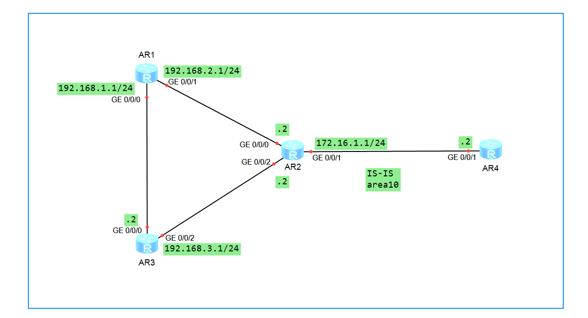

 
本实验使用ensp仿真模拟器配置

## IS-IS与BFD联动
如果需要提高链路状态变化时IS-IS协议的收敛速度，可以在运行OSPF协议的链路上配置BFD特性。  
当BFD检测到链路出现故障时，能够将故障通告给路由协议，触发路由协议的快速收敛；当邻居关系为Down时，将动态删除BFD会话。

## 实验目的
IS-IS通过周期性发送Hello报文来实现邻居检测，检测到故障的所需时间比较长，10s。在使用高速网络时，会丢失大量数据。  
为了解决上述问题，配置指定进程或端口的BFD for IS-IS特性，可以快速检测链路的状态，故障检测时间可达毫秒级，提高链路状态变化时的收敛速度。

## 实验设备
华为AR2220四台

## 实验拓扑


## 基础配置
>1.改名，改密码，关闭信息中心。  
``` bash
<Huawei>sy
Enter system view, return user view with Ctrl+Z.
[Huawei]sy R1
[R1]un in en
Info: Information center is disabled.
[R1]
```
其他也一样，不概述。  
>2.配置IP地址  

AR1：
``` bash
[R1]int g0/0/0
[R1-GigabitEthernet0/0/0]ip add 192.168.1.1 24
[R1-GigabitEthernet0/0/0]int g0/0/1
[R1-GigabitEthernet0/0/1]ip add 192.168.2.1 24
```
AR2:
``` bash
[R2]int g0/0/0
[R2-GigabitEthernet0/0/0]ip add 192.168.2.2 24
[R2-GigabitEthernet0/0/0]int g0/0/2
[R2-GigabitEthernet0/0/2]ip add 192.168.3.2 24
[R2-GigabitEthernet0/0/2]int g0/0/1
[R2-GigabitEthernet0/0/1]ip add 172.16.1.1 24
```
AR3:
``` bash
[R3]int g0/0/0
[R3-GigabitEthernet0/0/0]ip add 192.168.1.2 24
[R3-GigabitEthernet0/0/0]int g0/0/2
[R3-GigabitEthernet0/0/2]ip add 192.168.3.1 24
```
AR4:
``` bash
[R4]int g0/0/1
[R4-GigabitEthernet0/0/1]ip add 172.16.1.2 24
```
>3.配置IS-IS协议  

AR1:
``` bash
[R1]isis 1
[R1-isis-1]is-level level-1-2
[R1-isis-1]network-entity 10.0000.0000.0001.00
[R1-isis-1]quit
[R1]int g0/0/0
[R1-GigabitEthernet0/0/0]isis en
[R1-GigabitEthernet0/0/0]int g0/0/1
[R1-GigabitEthernet0/0/1]isis en
```
AR2:
``` bash
[R2]isis 1
[R2-isis-1]is-level level-1-2
[R2-isis-1]network-entity 10.0000.0000.0002.00
[R2]int g0/0/0
[R2-GigabitEthernet0/0/0]isis en
[R2-GigabitEthernet0/0/0]int g0/0/1
[R2-GigabitEthernet0/0/1]isis en
[R2-GigabitEthernet0/0/1]int g0/0/2
[R2-GigabitEthernet0/0/2]isis en
```
AR3:
``` bash
[R3]isis 1
[R3-isis-1]is-level level-1-2
[R3-isis-1]network-entity 10.0000.0000.0003.00
[R3]int g0/0/0
[R3-GigabitEthernet0/0/0]isis en
[R3-GigabitEthernet0/0/0]int g0/0/2
[R3-GigabitEthernet0/0/2]isis en
```
AR3:
``` bash
[R4]isis 1
[R4-isis-1]is-level level-1-2
[R4-isis-1]network-entity 10.0000.0000.0004.00
[R4-isis-1]q
[R4]int g0/0/1
[R4-GigabitEthernet0/0/1]isis en
```
>4.查看isis路由表  

以R1为例：
``` bash
<R1>dis isis rou

                         Route information for ISIS(1)
                         -----------------------------

                        ISIS(1) Level-1 Forwarding Table
                        --------------------------------

IPV4 Destination     IntCost    ExtCost ExitInterface   NextHop         Flags
-------------------------------------------------------------------------------
192.168.2.0/24       10         NULL    GE0/0/1         Direct          D/-/L/-
192.168.1.0/24       10         NULL    GE0/0/0         Direct          D/-/L/-
172.16.1.0/24        20         NULL    GE0/0/1         192.168.2.2     A/-/L/-
192.168.3.0/24       20         NULL    GE0/0/1         192.168.2.2     A/-/L/-
                                        GE0/0/0         192.168.1.2    
     Flags: D-Direct, A-Added to URT, L-Advertised in LSPs, S-IGP Shortcut,
                               U-Up/Down Bit Set


                        ISIS(1) Level-2 Forwarding Table
                        --------------------------------

IPV4 Destination     IntCost    ExtCost ExitInterface   NextHop         Flags
-------------------------------------------------------------------------------
192.168.2.0/24       10         NULL    GE0/0/1         Direct          D/-/L/-
192.168.1.0/24       10         NULL    GE0/0/0         Direct          D/-/L/-
172.16.1.0/24        20         NULL   
192.168.3.0/24       20         NULL   
     Flags: D-Direct, A-Added to URT, L-Advertised in LSPs, S-IGP Shortcut,
                               U-Up/Down Bit Set

<R1>
```
全网联通。
## 配置BFD
R1到R4都一样，不概述了。以R1为例。
``` bash
[R1]bfd
[R1-bfd]quit
[R1]isis
[R1-isis-1]bfd all-interfaces enable
[R1-isis-1]quit
```
查看bfd会话表,以R2为例：
``` bash
[R2]dis isis bfd session all

                      BFD session information for ISIS(1)
                      -----------------------------------

Peer System ID : 0000.0000.0001        Interface : GE0/0/0     
TX : 1000          BFD State : up      Peer IP Address : 192.168.2.1 
RX : 1000          LocDis : 8192       Local IP Address: 192.168.2.2 
Multiplier : 3     RemDis : 8193       Type : L1(L1L2)
Diag : No diagnostic information

Peer System ID : 0000.0000.0001        Interface : GE0/0/0     
TX : 1000          BFD State : up      Peer IP Address : 192.168.2.1 
RX : 1000          LocDis : 8192       Local IP Address: 192.168.2.2 
Multiplier : 3     RemDis : 8193       Type : L2(L1L2)
Diag : No diagnostic information

Peer System ID : 0000.0000.0004        Interface : GE0/0/1     
TX : 1000          BFD State : up      Peer IP Address : 172.16.1.2 
RX : 1000          LocDis : 8193       Local IP Address: 172.16.1.1 
Multiplier : 3     RemDis : 8192       Type : L1(L1L2)
Diag : No diagnostic information

Peer System ID : 0000.0000.0004        Interface : GE0/0/1     
TX : 1000          BFD State : up      Peer IP Address : 172.16.1.2 
RX : 1000          LocDis : 8193       Local IP Address: 172.16.1.1 
Multiplier : 3     RemDis : 8192       Type : L2(L1L2)
Diag : No diagnostic information

Peer System ID : 0000.0000.0003        Interface : GE0/0/2     
TX : 1000          BFD State : up      Peer IP Address : 192.168.3.1 
RX : 1000          LocDis : 8194       Local IP Address: 192.168.3.2 
Multiplier : 3     RemDis : 8193       Type : L1(L1L2)
Diag : No diagnostic information

Peer System ID : 0000.0000.0003        Interface : GE0/0/2     
TX : 1000          BFD State : up      Peer IP Address : 192.168.3.1 
RX : 1000          LocDis : 8194       Local IP Address: 192.168.3.2 
Multiplier : 3     RemDis : 8193       Type : L2(L1L2)
Diag : No diagnostic information

Total BFD session(s): 6
[R2]
```
可以看到，有6个bfd会话，代表所有路由器都已经开启了BFD.
### 扩展
  
>配置端口的BFD特性，AR1的GE0/0/1，AR2的GE0/0/0口上配置端口BFD特性，指定最小发送和接受的时间间隔为200ms，本地检测时间倍数为4。  

AR1:
``` bash
[R1]int g0/0/1	
[R1-GigabitEthernet0/0/1]isis bfd enable 
[R1-GigabitEthernet0/0/1]isis bfd min-rx-interval 200 min-tx-interval 200 detect-multiplier 4
```
AR2:
``` bash
[R2]int g0/0/0
[R2-GigabitEthernet0/0/0]isis bfd en	
[R2-GigabitEthernet0/0/0]isis bfd min-rx-interval 200 min-tx-interval 200 detect-multiplier 4
```
#### 测试
查看AR1的bfd会话表：
``` bash
[R1]dis isis bfd session all

                      BFD session information for ISIS(1)
                      -----------------------------------

Peer System ID : 0000.0000.0003        Interface : GE0/0/0     
TX : 1000          BFD State : up      Peer IP Address : 192.168.1.2 
RX : 1000          LocDis : 8192       Local IP Address: 192.168.1.1 
Multiplier : 3     RemDis : 8192       Type : L1(L1L2)
Diag : No diagnostic information

Peer System ID : 0000.0000.0003        Interface : GE0/0/0     
TX : 1000          BFD State : up      Peer IP Address : 192.168.1.2 
RX : 1000          LocDis : 8192       Local IP Address: 192.168.1.1 
Multiplier : 3     RemDis : 8192       Type : L2(L1L2)
Diag : No diagnostic information

Peer System ID : 0000.0000.0002        Interface : GE0/0/1     
TX : 200           BFD State : up      Peer IP Address : 192.168.2.2 
RX : 200           LocDis : 8193       Local IP Address: 192.168.2.1 
Multiplier : 4     RemDis : 8192       Type : L1(L1L2)
Diag : No diagnostic information

Peer System ID : 0000.0000.0002        Interface : GE0/0/1     
TX : 200           BFD State : up      Peer IP Address : 192.168.2.2 
RX : 200           LocDis : 8193       Local IP Address: 192.168.2.1 
Multiplier : 4     RemDis : 8192       Type : L2(L1L2)
Diag : No diagnostic information

Total BFD session(s): 4
```
可以看到，最小发送和接受的时间间隔为200ms，本地检测时间倍数为4。
## 测试结果
AR1 tracert AR4:
``` bash
[R1]tracert 172.16.1.2

 traceroute to  172.16.1.2(172.16.1.2), max hops: 30 ,packet length: 40,press CT
RL_C to break 

 1 192.168.2.2 30 ms  10 ms  20 ms 

 2 172.16.1.2 30 ms  20 ms  30 ms 
[R1]
```
可以看到，是最佳路径。
>故意shutdown AR2的GE0/0/0口，模拟线路故障。并迅速AR1 tracert AR4
AR1 tracert R4:
``` bash
[R1]tracert 172.16.1.2

 traceroute to  172.16.1.2(172.16.1.2), max hops: 30 ,packet length: 40,press CT
RL_C to break 

 1 192.168.1.2 30 ms  10 ms  20 ms 

 2 192.168.3.2 20 ms  20 ms  20 ms 

 3 172.16.1.2 20 ms  30 ms  40 ms 
[R1]
```
线路在很快的时间内收敛。BFD联动完成。