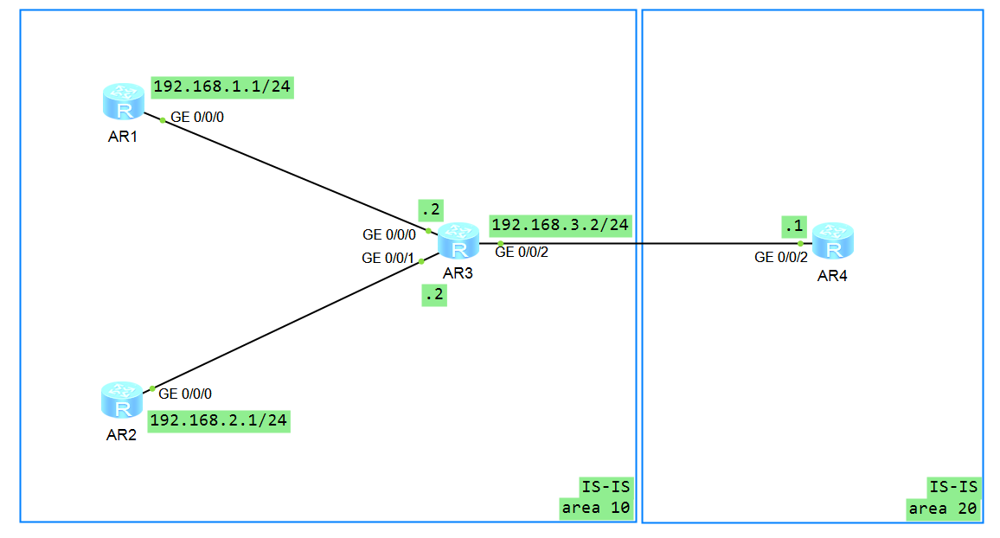

## IS-IS协议基本功能配置实例
与OSPF协议非常的相似，IS-IS协议也是基于链路状态并使用最短路径优先算法进行路由的一种 IGP 协议。

IS-IS（Intermediate System-to-Intermediate System，中间系统到中间系统）路由协议最初是ISO（the International Organization for Standardization，国际标准化组织）为CLNP（Connection Less Network Protocol，无连接网络协议）设计的一种动态路由协议。  
现在CLNP网络已经基本不再使用，但是IS-IS协议由于其优秀性，被保留了下来。

## 实验目的
路由器之间通过IS-IS协议互联。

## 实验设备
华为AR2220(三台)

## 实验拓扑


## 基础配置
1. 改名，改密码，关闭信息中心。
      
AR1：
``` bash
<Huawei>sy
Enter system view, return user view with Ctrl+Z.
[Huawei]sy R1
[R1]un in en
Info: Information center is disabled.
[R1]
```
AR2:
``` bash
<Huawei>sy
Enter system view, return user view with Ctrl+Z.
[Huawei]sy R2
[R2]un in en
Info: Information center is disabled.
[R2]
```
以下都一样，就不概述了。   

2. 配置IP地址
AR1:
``` bash
[R1]int g0/0/0
[R1-GigabitEthernet0/0/0]ip add 192.168.1.1 24
```
AR2:
``` bash
[R2]int g0/0/0
[R2-GigabitEthernet0/0/0]ip add 192.168.2.1 24
```
AR3:
``` bash
[R3]int g0/0/0
[R3-GigabitEthernet0/0/0]ip add 192.168.1.2 24
[R3-GigabitEthernet0/0/0]q
[R3]int g0/0/1
[R3-GigabitEthernet0/0/1]ip add 192.168.2.2 24
[R3-GigabitEthernet0/0/1]q
[R3]int g0/0/2
[R3-GigabitEthernet0/0/2]ip add 192.168.3.2 24
[R3-GigabitEthernet0/0/2]q
[R3]
```
AR4:
``` bash
[R4]int g0/0/2
[R4-GigabitEthernet0/0/2]ip add 192.168.3.1 24
```
## 配置IS-IS协议
AR1：
``` bash
[R1]isis 1
[R1-isis-1]is-level level-1	
[R1-isis-1]network-entity 10.0000.0000.0001.00
[R1-isis-1]quit
[R1]int g0/0/0
[R1-GigabitEthernet0/0/0]isis enable
[R1-GigabitEthernet0/0/0]quit
[R1]
```
AR2:
``` bash
[R2]isis 1
[R2-isis-1]is-level level-1
[R2-isis-1]network-entity 10.0000.0000.0002.00
[R2-isis-1]quit
[R2]int g0/0/0
[R2-GigabitEthernet0/0/0]isis enable
[R2-GigabitEthernet0/0/0]quit
```
AR3:
``` bash
[R3]isis 1
[R3-isis-1]is-level level-1-2
[R3-isis-1]network-entity 10.0000.0000.0003.00
[R3-isis-1]quit
[R3]int g0/0/0
[R3-GigabitEthernet0/0/0]isis enable
[R3-GigabitEthernet0/0/0]quit
[R3]int g0/0/1
[R3-GigabitEthernet0/0/1]isis enable
[R3-GigabitEthernet0/0/1]quit
[R3]int g0/0/2
[R3-GigabitEthernet0/0/2]isis enable
[R3-GigabitEthernet0/0/2]quit
[R3]
```
AR4：
``` bash
[R4]isis 1
[R4-isis-1]is-level level-2
[R4-isis-1]network 20.0000.0000.0004.00
[R4-isis-1]quit
[R4]int g0/0/2
[R4-GigabitEthernet0/0/2]isis enable
[R4-GigabitEthernet0/0/2]quit
[R4]
```
## 测试
查看AR3的配置结果
``` bash
[R3]dis isis lsdb

                        Database information for ISIS(1)
                        --------------------------------

                          Level-1 Link State Database

LSPID                 Seq Num      Checksum      Holdtime      Length  ATT/P/OL
-------------------------------------------------------------------------------
0000.0000.0001.00-00  0x00000003   0x93f1        965           68      0/0/0   
0000.0000.0001.01-00  0x00000001   0xd1ba        964           55      0/0/0   
0000.0000.0002.00-00  0x00000003   0xe0a0        980           68      0/0/0   
0000.0000.0002.01-00  0x00000001   0xdaaf        978           55      0/0/0   
0000.0000.0003.00-00* 0x00000007   0xa34c        1136          111     1/0/0   

Total LSP(s): 5
    *(In TLV)-Leaking Route, *(By LSPID)-Self LSP, +-Self LSP(Extended), 
           ATT-Attached, P-Partition, OL-Overload


                          Level-2 Link State Database

LSPID                 Seq Num      Checksum      Holdtime      Length  ATT/P/OL
-------------------------------------------------------------------------------
0000.0000.0003.00-00* 0x00000007   0x444a        1136          100     0/0/0   
0000.0000.0004.00-00  0x00000003   0xbdab        1135          68      0/0/0   
0000.0000.0004.01-00  0x00000001   0xee95        1135          55      0/0/0   

Total LSP(s): 3
    *(In TLV)-Leaking Route, *(By LSPID)-Self LSP, +-Self LSP(Extended), 
           ATT-Attached, P-Partition, OL-Overload

[R3]
```
AR2:
``` bash
<R2>dis isis lsdb

                        Database information for ISIS(1)
                        --------------------------------

                          Level-1 Link State Database

LSPID                 Seq Num      Checksum      Holdtime      Length  ATT/P/OL
-------------------------------------------------------------------------------
0000.0000.0001.00-00  0x00000003   0x93f1        824           68      0/0/0   
0000.0000.0001.01-00  0x00000001   0xd1ba        823           55      0/0/0   
0000.0000.0002.00-00* 0x00000003   0xe0a0        841           68      0/0/0   
0000.0000.0002.01-00* 0x00000001   0xdaaf        840           55      0/0/0   
0000.0000.0003.00-00  0x00000007   0xa34c        995           111     1/0/0   

Total LSP(s): 5
    *(In TLV)-Leaking Route, *(By LSPID)-Self LSP, +-Self LSP(Extended), 
           ATT-Attached, P-Partition, OL-Overload
```
可以看到，配置结果一样。
AR1的路由表中应该有一条默认路由，指向L1/2路由。
查看路由信息：
```  bash
<R1>dis isis rou

                         Route information for ISIS(1)
                         -----------------------------

                        ISIS(1) Level-1 Forwarding Table
                        --------------------------------

IPV4 Destination     IntCost    ExtCost ExitInterface   NextHop         Flags
-------------------------------------------------------------------------------
0.0.0.0/0            10         NULL    GE0/0/0         192.168.1.2     A/-/-/-
192.168.2.0/24       20         NULL    GE0/0/0         192.168.1.2     A/-/-/-
192.168.1.0/24       10         NULL    GE0/0/0         Direct          D/-/L/-
192.168.3.0/24       20         NULL    GE0/0/0         192.168.1.2     A/-/-/-
     Flags: D-Direct, A-Added to URT, L-Advertised in LSPs, S-IGP Shortcut,
                               U-Up/Down Bit Set
```
至此，全网连通。