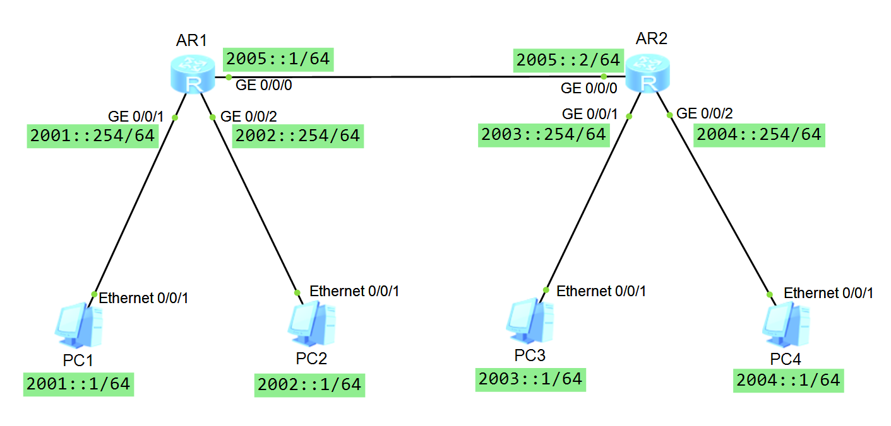

 
本实验使用ensp仿真模拟器配置

## OSPFv3协议
OSPFv3相对于OSPFv2，基本原理相同但是是一个独立的路由协议。  
OSPFv3是基于IPv6的OSPF协议，因此，IPv6的特定对OSPFv3造成了一定的影响。具体如下表所示：  

| IPv6特性     | OSPFv3相应的影响 |
| ----------- | ----------- |
| IPv6地址为128位      | LSA长度增加       |
| IPv6中存在LLA地址   | 除了建立Vlink之外，OSPFv3使用LLA地址进行报文交互        |
|接口可以配置多个全球单播地址|运行于每个LLA进行通信，不再基于subnet |
|IPv6支持验证功能|使用IPv6扩展头进行报文的认证和加密|  

参考自：

## 实验目的
配置AR1，AR2使用ospfv3协议互通

## 实验设备
华为AR2240两台，PC模拟终端4台

## 实验拓扑


## 基础配置
1. 改名，改密码，关闭信息中心。  
AR1:
``` bash
<Huawei>sy
Enter system view, return user view with Ctrl+Z.
[Huawei]sy R1
[R1]un in en
Info: Information center is disabled.
[R1]
```
AR2:
``` bash
<Huawei>sy
Enter system view, return user view with Ctrl+Z.
[Huawei]sy R2
[R2]un in en
Info: Information center is disabled.
[R2]
```
2. 配置IP地址  

开启ipv6:  
R1:
``` bash
[R1]ipv6
```
R2:
``` bash
[R2]ipv6
```

配置IP地址：  
R1
``` bash
[R1]int g0/0/1
[R1-GigabitEthernet0/0/1]ipv6 enable 
[R1-GigabitEthernet0/0/1]ipv6 add 2001::254 64
[R1]int g0/0/2
[R1-GigabitEthernet0/0/2]ipv6 enable 
[R1-GigabitEthernet0/0/2]ipv6 add 2002::254 64
[R1]int g0/0/0
[R1-GigabitEthernet0/0/0]ipv6 enable
[R1-GigabitEthernet0/0/0]ipv6 add 2005::1 64
```
R2:
``` bash
[R2]int g0/0/1
[R2-GigabitEthernet0/0/1]ipv6 enable
[R2-GigabitEthernet0/0/1]ipv6 add 2003::254 64
[R2]int g0/0/2
[R2-GigabitEthernet0/0/2]ipv6 enable
[R2-GigabitEthernet0/0/2]ipv6 add 2004::254 64
[R2]int g0/0/0
[R2-GigabitEthernet0/0/0]ipv6 enable
[R2-GigabitEthernet0/0/0]ipv6 add 2005::2 64
```
## OSPF配置
R1配置路由ID为1.1.1.1，R1配置路由ID为2.2.2.2
R1：
``` bash
[R1]ospfv3 1
[R1-ospfv3-1]router-id 1.1.1.1
[R1]int g0/0/1
[R1-GigabitEthernet0/0/1]ospfv3 1 area 0
[R1]int g0/0/2
[R1-GigabitEthernet0/0/2]ospfv3 1 area 0
[R1]int g0/0/0
[R1-GigabitEthernet0/0/0]ospfv3 1 area 0
```
R2:
``` bash
[R2]ospfv3 1
[R2-ospfv3-1]router-id 2.2.2.2
[R2]int g0/0/1
[R2-GigabitEthernet0/0/1]ospfv3 1 area 0
[R2]int g0/0/2
[R2-GigabitEthernet0/0/2]ospfv3 1 area 0
[R2]int g0/0/0
[R2-GigabitEthernet0/0/0]ospfv3 1 area 0
```
## 测试
查看R1的ipv4地址表：
``` bash
[R1]dis ipv6 routing-table 
Routing Table : Public
	Destinations : 10	Routes : 10
......
 Destination  : 2003::                          PrefixLength : 64
 NextHop      : FE80::2E0:FCFF:FE57:5887        Preference   : 10
 Cost         : 2                               Protocol     : OSPFv3
 RelayNextHop : ::                              TunnelID     : 0x0
 Interface    : GigabitEthernet0/0/0            Flags        : D

 Destination  : 2004::                          PrefixLength : 64
 NextHop      : FE80::2E0:FCFF:FE57:5887        Preference   : 10
 Cost         : 2                               Protocol     : OSPFv3
 RelayNextHop : ::                              TunnelID     : 0x0
 Interface    : GigabitEthernet0/0/0            Flags        : D
 ......
```
查看ospfv3邻居关系：
R1:
``` bash
[R1]dis ospfv3 peer
OSPFv3 Process (1)
OSPFv3 Area (0.0.0.0)
Neighbor ID     Pri  State            Dead Time Interface            Instance ID
2.2.2.2           1  Full/Backup      00:00:33  GE0/0/0                        0

```
R2:
``` bash
[R2]dis ospfv3 peer
OSPFv3 Process (1)
OSPFv3 Area (0.0.0.0)
Neighbor ID     Pri  State            Dead Time Interface            Instance ID
1.1.1.1           1  Full/DR          00:00:37  GE0/0/0                        0

```
R1与R2有邻居关系，全网互通。