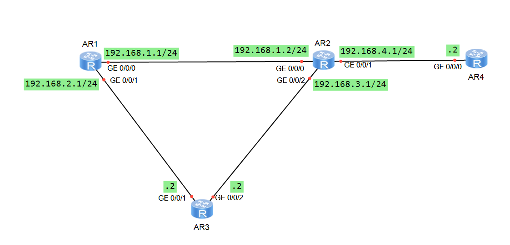

## OSPF与BFD联动
如果需要提高链路状态变化时OSPF协议的收敛速度，可以在运行OSPF协议的链路上配置BFD特性。  
当BFD检测到链路出现故障时，能够将故障通告给路由协议，触发路由协议的快速收敛；当邻居关系为Down时，将动态删除BFD会话。

## 实验目的
OSPF通过周期性发送Hello报文来实现邻居检测，检测到故障的所需时间比较长，超过1s。在使用高速网络时，会丢失大量数据。  
为了解决上述问题，配置指定进程或端口的BFD for OSPF特性，可以快速检测链路的状态，故障检测时间可达毫秒级，提高链路状态变化时的收敛速度。

## 实验设备
华为AR2220三台

## 实验拓扑


## 基础配置
1. 改名，改密码，关闭信息中心。  
AR1:
``` bash
<Huawei>sy
Enter system view, return user view with Ctrl+Z.
[Huawei]sy R1
[R1]un in en
Info: Information center is disabled.
[R1]
```
AR2:
``` bash
<Huawei>sy
Enter system view, return user view with Ctrl+Z.
[Huawei]sy R2
[R2]un in en
Info: Information center is disabled.
[R2]
```
AR3：
``` bash
<Huawei>sy
Enter system view, return user view with Ctrl+Z.
[Huawei]sy R3
[R3]un in en
Info: Information center is disabled.
[R3]
```
AR4：
``` bash
<Huawei>sy
Enter system view, return user view with Ctrl+Z.
[Huawei]sy R4
[R4]un in en
Info: Information center is disabled.
[R4]
```
2. 配置IP地址  
R1:
``` bash
[R1]int g0/0/0
[R1-GigabitEthernet0/0/0]ip add 192.168.1.1 24
[R1]int g0/0/1
[R1-GigabitEthernet0/0/1]ip add 192.168.2.1 24
```
R2:
``` bash
[R2]int g0/0/0
[R2-GigabitEthernet0/0/0]ip add 192.168.1.2 24
[R2]int g0/0/1
[R2-GigabitEthernet0/0/1]ip add 192.168.4.1 24
[R2]int g0/0/2
[R2-GigabitEthernet0/0/2]ip add 192.168.3.1 24
```
R3:
``` bash
[R3]int g0/0/1
[R3-GigabitEthernet0/0/1]ip add 192.168.2.2 24
[R3]int g0/0/2
[R3-GigabitEthernet0/0/2]ip add 192.168.3.2 24
```
R4:
``` bash
[R3]int g0/0/0
[R3-GigabitEthernet0/0/0]ip add 192.168.4.2 24
```
2.配置OSPF
R1:
``` bash
[R1]ospf 1 r 1.1.1.1
[R1-ospf-1]a 0
[R1-ospf-1-area-0.0.0.0]n 192.168.1.0 0.0.0.255
[R1-ospf-1-area-0.0.0.0]n 192.168.2.0 0.0.0.255
```
R2:
``` bash
[R2]ospf 1 r 2.2.2.2
[R2-ospf-1]a 0
[R2-ospf-1-area-0.0.0.0]n 192.168.1.0 0.0.0.255
[R2-ospf-1-area-0.0.0.0]n 192.168.3.0 0.0.0.255
[R2-ospf-1-area-0.0.0.0]n 192.168.4.0 0.0.0.255
```

R3:
```bash
[R3]ospf 1 r 3.3.3.3
[R3-ospf-1]a 0
[R3-ospf-1-area-0.0.0.0]n 192.168.2.0 0.0.0.255
[R3-ospf-1-area-0.0.0.0]n 192.168.3.0 0.0.0.255
```
R4:
```bash
[R4]ospf 1 r 4.4.4.4
[R4-ospf-1]a 0
[R4-ospf-1-area-0.0.0.0]n 192.168.4.0 0.0.0.255
```
3.查看ospf配置
R1查看邻居表：
``` bash
[R1]dis ospf peer

	 OSPF Process 1 with Router ID 1.1.1.1
		 Neighbors 

 Area 0.0.0.0 interface 192.168.1.1(GigabitEthernet0/0/0)'s neighbors
 Router ID: 2.2.2.2          Address: 192.168.1.2     
   State: Full  Mode:Nbr is  Master  Priority: 1
   DR: 192.168.1.1  BDR: 192.168.1.2  MTU: 0    
   Dead timer due in 31  sec 
   Retrans timer interval: 5 
   Neighbor is up for 00:02:15     
   Authentication Sequence: [ 0 ] 

		 Neighbors 

 Area 0.0.0.0 interface 192.168.2.1(GigabitEthernet0/0/1)'s neighbors
 Router ID: 3.3.3.3          Address: 192.168.2.2     
   State: Full  Mode:Nbr is  Master  Priority: 1
   DR: 192.168.2.1  BDR: 192.168.2.2  MTU: 0    
   Dead timer due in 34  sec 
   Retrans timer interval: 5 
   Neighbor is up for 00:01:04     
   Authentication Sequence: [ 0 ] 

```

R2查看邻居表：
``` bash
[R2]dis ospf peer

	 OSPF Process 1 with Router ID 2.2.2.2
		 Neighbors 

 Area 0.0.0.0 interface 192.168.1.2(GigabitEthernet0/0/0)'s neighbors
 Router ID: 1.1.1.1          Address: 192.168.1.1     
   State: Full  Mode:Nbr is  Slave  Priority: 1
   DR: 192.168.1.1  BDR: 192.168.1.2  MTU: 0    
   Dead timer due in 39  sec 
   Retrans timer interval: 5 
   Neighbor is up for 00:03:24     
   Authentication Sequence: [ 0 ] 

		 Neighbors 

 Area 0.0.0.0 interface 192.168.3.1(GigabitEthernet0/0/2)'s neighbors
 Router ID: 3.3.3.3          Address: 192.168.3.2     
   State: Full  Mode:Nbr is  Master  Priority: 1
   DR: 192.168.3.1  BDR: 192.168.3.2  MTU: 0    
   Dead timer due in 32  sec 
   Retrans timer interval: 5 
   Neighbor is up for 00:02:08     
   Authentication Sequence: [ 0 ] 

		 Neighbors 

 Area 0.0.0.0 interface 192.168.4.1(GigabitEthernet0/0/1)'s neighbors
 Router ID: 4.4.4.4          Address: 192.168.4.2     
   State: Full  Mode:Nbr is  Master  Priority: 1
   DR: 192.168.4.1  BDR: 192.168.4.2  MTU: 0    
   Dead timer due in 38  sec 
   Retrans timer interval: 5 
   Neighbor is up for 00:01:22     
   Authentication Sequence: [ 0 ] 

```
邻居关系成功建立。
R1查看ipv4路由表：
``` bash
[R1]dis ip ro
Route Flags: R - relay, D - download to fib
------------------------------------------------------------------------------
Routing Tables: Public
         Destinations : 12       Routes : 13       

Destination/Mask    Proto   Pre  Cost      Flags NextHop         Interface

      127.0.0.0/8   Direct  0    0           D   127.0.0.1       InLoopBack0
      127.0.0.1/32  Direct  0    0           D   127.0.0.1       InLoopBack0
127.255.255.255/32  Direct  0    0           D   127.0.0.1       InLoopBack0
    192.168.1.0/24  Direct  0    0           D   192.168.1.1     GigabitEthernet0/0/0
    192.168.1.1/32  Direct  0    0           D   127.0.0.1       GigabitEthernet0/0/0
  192.168.1.255/32  Direct  0    0           D   127.0.0.1       GigabitEthernet0/0/0
    192.168.2.0/24  Direct  0    0           D   192.168.2.1     GigabitEthernet0/0/1
    192.168.2.1/32  Direct  0    0           D   127.0.0.1       GigabitEthernet0/0/1
  192.168.2.255/32  Direct  0    0           D   127.0.0.1       GigabitEthernet0/0/1
    192.168.3.0/24  OSPF    10   2           D   192.168.1.2     GigabitEthernet0/0/0
                    OSPF    10   2           D   192.168.2.2     GigabitEthernet0/0/1
    192.168.4.0/24  OSPF    10   2           D   192.168.1.2     GigabitEthernet0/0/0
255.255.255.255/32  Direct  0    0           D   127.0.0.1       InLoopBack0

```
路由表正常。
## 配置BFD
开始配置之前，先追踪一下路由，看看数据包在哪个路由器中传输。
R1 tracert R4
``` bash
[R1]tracert 192.168.4.2

 traceroute to  192.168.4.2(192.168.4.2), max hops: 30 ,packet length: 40,press 
CTRL_C to break 

 1 192.168.1.2 30 ms  10 ms  30 ms 

 2 192.168.4.2 30 ms  20 ms  20 ms 
```
可以看到，R1优先向R2发送数据包，因为这是OSPF计算出的最短路径。
接下来开始配置BFD。
R1,R2,R3,R4配置命令一样，以R1为例：
``` bash
[R1]bfd
[R1-bfd]q
[R1]ospf 1	
[R1-ospf-1]bfd all-interfaces enable 
```
配置完成后，查看R1到R4的BFD会话表，以R1为例：
``` bash
[R1]dis ospf bfd session al

	 OSPF Process 1 with Router ID 1.1.1.1
  Area 0.0.0.0 interface 192.168.1.1(GigabitEthernet0/0/0)''s BFD Sessions

 NeighborId:2.2.2.2          AreaId:0.0.0.0          Interface:GigabitEthernet0/
0/0
 BFDState:up                 rx    :1000             tx       :1000          
 Multiplier:3                BFD Local Dis:8192      LocalIpAdd:192.168.1.1
 RemoteIpAdd:192.168.1.2     Diagnostic Info:No diagnostic information

  Area 0.0.0.0 interface 192.168.2.1(GigabitEthernet0/0/1)''s BFD Sessions

 NeighborId:3.3.3.3          AreaId:0.0.0.0          Interface:GigabitEthernet0/
0/1
 BFDState:up                 rx    :1000             tx       :1000          
 Multiplier:3                BFD Local Dis:8193      LocalIpAdd:192.168.2.1
 RemoteIpAdd:192.168.2.2     Diagnostic Info:No diagnostic information

```
当状态为up时，代表bfd已经启用成功了。  
 - 扩展：
配置R1的GE0/0/0端口的BFD特性，指定最小发送和接收的时间间隔为300ms，本地检测时间倍数为4.
``` bash
[R1]int g0/0/0
[R1-GigabitEthernet0/0/0]ospf bfd enable 
[R1-GigabitEthernet0/0/0]ospf bfd min-rx-interval 300 min-tx-interval 300 detect
-multiplier 4
[R1-GigabitEthernet0/0/0]dis this
[V200R003C00]
#
interface GigabitEthernet0/0/0
 ip address 192.168.1.1 255.255.255.0 
 ospf bfd enable
 ospf bfd min-tx-interval 300 min-rx-interval 300 detect-multiplier 4
#
return
[R1-GigabitEthernet0/0/0]
```
配置R2的GE0/0/0端口的BFD特性，指定最小发送和接收的时间间隔为300ms，本地检测时间倍数为4.
``` bash
[R2]int g0/0/0
[R2-GigabitEthernet0/0/0]ospf bfd enable 
[R2-GigabitEthernet0/0/0]ospf bfd min-rx-interval 300 min-tx-interval 300 detect
-multiplier 4
[R2-GigabitEthernet0/0/0]dis this
[V200R003C00]
#
interface GigabitEthernet0/0/0
 ip address 192.168.1.2 255.255.255.0 
 ospf bfd enable
 ospf bfd min-tx-interval 300 min-rx-interval 300 detect-multiplier 4
#
return
[R2-GigabitEthernet0/0/0]
```
配置完成后，查看R1和R2的BFD会话表，以R1为例：
``` bash
[R1]dis ospf bfd session all

	 OSPF Process 1 with Router ID 1.1.1.1
  Area 0.0.0.0 interface 192.168.1.1(GigabitEthernet0/0/0)''s BFD Sessions

 NeighborId:2.2.2.2          AreaId:0.0.0.0          Interface:GigabitEthernet0/
0/0
 BFDState:up                 rx    :300              tx       :300           
 Multiplier:4                BFD Local Dis:8192      LocalIpAdd:192.168.1.1
 RemoteIpAdd:192.168.1.2     Diagnostic Info:No diagnostic information

  Area 0.0.0.0 interface 192.168.2.1(GigabitEthernet0/0/1)''s BFD Sessions

 NeighborId:3.3.3.3          AreaId:0.0.0.0          Interface:GigabitEthernet0/
0/1
 BFDState:up                 rx    :1000             tx       :1000          
 Multiplier:3                BFD Local Dis:8193      LocalIpAdd:192.168.2.1
 RemoteIpAdd:192.168.2.2     Diagnostic Info:No diagnostic information

[R1]
```
可以看到，最小发送和接收的时间间隔为300ms，本地检测时间倍数为4。

## 测试
故意shutdown R2的GE0/0/0端口，模拟线路故障并迅速R1 tracert R4.
``` bash
[R1]tracert 192.168.4.2

 traceroute to  192.168.4.2(192.168.4.2), max hops: 30 ,packet length: 40,press 
CTRL_C to break 

 1 192.168.2.2 30 ms  40 ms  20 ms 

 2 192.168.3.1 30 ms  30 ms  20 ms 

 3 192.168.4.2 50 ms  30 ms  30 ms 
[R1]
```
可以看到，R1将数据包发送给了备份路由器R3，ospf以很快的速度收敛。