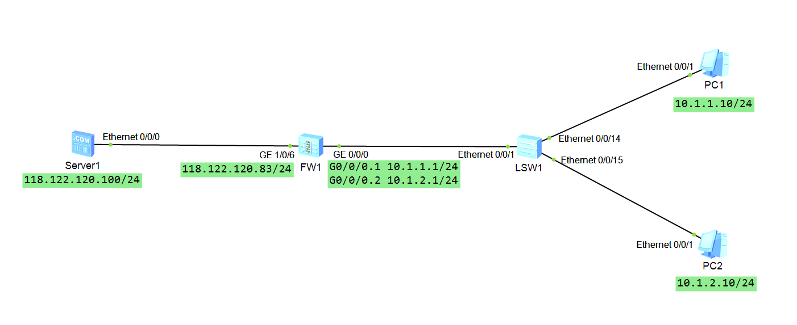

# 华为防火墙配置NAT地址转换
 
本实验使用ensp仿真模拟器配置


## 实验目的
配置HFW1防火墙各种地址NAT地址转换

## 实验设备
华为USG6000v一台（简称FW1）

## 实验拓扑


## 基础配置
1. 改名，改密码，关闭信息中心。
``` bash
<USG6000V1>sy
Enter system view, return user view with Ctrl+Z.
[USG6000V1]sy FW1
[FW1]un in en
Info: Saving log files...
Info: Information center is disabled.
[FW1]
```
2. 配置IP地址
``` bash
[FW1]int g1/0/6
[FW1-GigabitEthernet1/0/6]ip add 118.122.120.83 24
[FW1-GigabitEthernet1/0/6]q
[FW1]int g0/0/0.1
[FW1-GigabitEthernet0/0/0.1]ip add 10.1.1.1 24
[FW1-GigabitEthernet0/0/0.1]vlan-type dot1q 10 #封装vlanid
[FW1-GigabitEthernet0/0/0.1]service-manage ping permit
[FW1-GigabitEthernet0/0/0.1]q
[FW1-GigabitEthernet0/0/0.2]ip add 10.1.2.1 24
[FW1-GigabitEthernet0/0/0.2]vlan-type dot1q 20 #封装vlanid
[FW1-GigabitEthernet0/0/0.2]service-manage ping permit
[FW1-GigabitEthernet0/0/0.2]q
[FW1]
```
3. 配置安全区域
``` bash
[FW1]firewall zone untrust
[FW1-zone-untrust]add int g1/0/6
...
[FW1]firewall zone trust 
[FW1-zone-trust]add int g0/0/0.1
[FW1-zone-trust]add int g0/0/0.2
...
#
trust
 priority is 85
 interface of the zone is (3):
    GigabitEthernet0/0/0
    GigabitEthernet0/0/0.1
    GigabitEthernet0/0/0.2
#
untrust
 priority is 5
 interface of the zone is (1):
    GigabitEthernet1/0/6
#

```
4. 配置安全策略
``` bash
[FW1]security-policy 
[FW1-policy-security]rule name to_untrust
[FW1-policy-security-rule-to_untrust]source-zone trust 
[FW1-policy-security-rule-to_untrust]destination-zone untrust 
[FW1-policy-security-rule-to_untrust]source-zone local 
[FW1-policy-security-rule-to_untrust]action permit 
...
#
security-policy
 rule name to_untrust
  source-zone local
  source-zone trust
  destination-zone untrust
  action permit
#
```
5. 配置交换机vlan
``` bash
vlan batch 10 20
#
interface Ethernet0/0/14
 port link-type access
 port default vlan 10
#
interface Ethernet0/0/15
 port link-type access
 port default vlan 20
#
interface Ethernet0/0/1
 port link-type trunk
 port trunk allow-pass vlan 2 to 4094
#
```
## Easy-ip转换
Easy ip——允许将多个内部地址映射到网关出接口地址上的不同端口
配置nat策略：
``` bash
[FW1]nat-policy 
[FW1-policy-nat]rule name easy_ip
[FW1-policy-nat-rule-easy_ip]source-zone trust 
[FW1-policy-nat-rule-easy_ip]destination-zone untrust 
[FW1-policy-nat-rule-easy_ip]action source-nat easy-ip 
[FW1-policy-nat-rule-easy_ip]dis this
...
 rule name easy_ip
  source-zone trust
  destination-zone untrust
  action source-nat easy-ip
#
return
```
### 测试结果
PC1(vlan10 IP地址:10.1.1.10) ping server1(118.122.120.100)
```bash
PC>ping 118.122.120.100

Ping 118.122.120.100: 32 data bytes, Press Ctrl_C to break
From 118.122.120.100: bytes=32 seq=1 ttl=254 time=32 ms
From 118.122.120.100: bytes=32 seq=2 ttl=254 time=16 ms
From 118.122.120.100: bytes=32 seq=3 ttl=254 time=47 ms
From 118.122.120.100: bytes=32 seq=4 ttl=254 time=47 ms
From 118.122.120.100: bytes=32 seq=5 ttl=254 time=31 ms

--- 118.122.120.100 ping statistics ---
  5 packet(s) transmitted
  5 packet(s) received
  0.00% packet loss
  round-trip min/avg/max = 16/34/47 ms
```
将trust地址转换为防火墙出口地址，端口不同
``` bash
[FW1]dis firewall session table 
 Current Total Sessions : 5
 icmp  VPN: public --> public  10.1.1.10:57291[118.122.120.83:2049] --> 118.122.120.100:2048
 icmp  VPN: public --> public  10.1.1.10:57803[118.122.120.83:2051] --> 118.122.120.100:2048
 icmp  VPN: public --> public  10.1.1.10:57547[118.122.120.83:2050] --> 118.122.120.100:2048
 icmp  VPN: public --> public  10.1.1.10:58059[118.122.120.83:2052] --> 118.122.120.100:2048
 icmp  VPN: public --> public  10.1.1.10:57035[118.122.120.83:2048] --> 118.122.120.100:2048
[FW1]
```

PC2(vlan20 IP地址:10.1.2.10) ping server1(118.122.120.100)  
查看会话表：
``` bash
 Current Total Sessions : 5
 icmp  VPN: public --> public  10.1.2.10:30924[118.122.120.83:2054] --> 118.122.120.100:2048
 icmp  VPN: public --> public  10.1.2.10:31692[118.122.120.83:2057] --> 118.122.120.100:2048
 icmp  VPN: public --> public  10.1.2.10:31436[118.122.120.83:2056] --> 118.122.120.100:2048
 icmp  VPN: public --> public  10.1.2.10:31180[118.122.120.83:2055] --> 118.122.120.100:2048
 icmp  VPN: public --> public  10.1.2.10:30668[118.122.120.83:2053] --> 118.122.120.100:2048
```
IP转换为路由器的`出口IP`(118.122.120.83)

## NAPT地址转换
NAPT: Network Address Port Transfer 网络地址端口转换。也叫PAT。  
使用一个合法公网地址，以不同的协议端口号与不同的内部地址相对应，也就是  
`<内部地址+内部端口>`与`<外部地址+外部端口>`之间的转换  
1. 配置NAT地址池：
``` bash
[FW1]nat address-group napt_ip
[FW1-address-group-napt_ip]section 118.122.120.115 118.122.120.116
[FW1-address-group-napt_ip]mode pat
[FW1-address-group-napt_ip]dis this
...
nat address-group napt_ip 0 #地址池id
 mode pat #pat模式
 section 0 118.122.120.115 118.122.120.116 #地址池范围112.122.120.115~116
#
```
2.配置nat策略
``` bash
[FW1]nat-policy
[FW1-policy-nat]rule name napt
[FW1-policy-nat-rule-napt]destination-zone untrust 
[FW1-policy-nat-rule-napt]source-zone trust 
[FW1-policy-nat-rule-napt]action source-nat address-group napt_ip
[FW1-policy-nat-rule-napt]dis this
···
 rule name napt
  source-zone trust
  destination-zone untrust
  action source-nat address-group napt_ip
#
```
### 测试结果
PC1(vlan10 IP地址:10.1.1.10) ping server1(118.122.120.100)
``` bash
PC>ping 118.122.120.100

Ping 118.122.120.100: 32 data bytes, Press Ctrl_C to break
From 118.122.120.100: bytes=32 seq=1 ttl=254 time=31 ms
From 118.122.120.100: bytes=32 seq=2 ttl=254 time=47 ms
From 118.122.120.100: bytes=32 seq=3 ttl=254 time=32 ms
From 118.122.120.100: bytes=32 seq=4 ttl=254 time=31 ms
From 118.122.120.100: bytes=32 seq=5 ttl=254 time=31 ms

--- 118.122.120.100 ping statistics ---
  5 packet(s) transmitted
  5 packet(s) received
  0.00% packet loss
  round-trip min/avg/max = 31/34/47 ms
```
转换为地址池指定的IP地址：
``` bash
 Current Total Sessions : 5
 icmp  VPN: public --> public  10.1.1.10:34512[118.122.120.115:2052] --> 118.122.120.100:2048
 icmp  VPN: public --> public  10.1.1.10:34256[118.122.120.115:2051] --> 118.122.120.100:2048
 icmp  VPN: public --> public  10.1.1.10:34000[118.122.120.115:2050] --> 118.122.120.100:2048
 icmp  VPN: public --> public  10.1.1.10:33744[118.122.120.115:2049] --> 118.122.120.100:2048
 icmp  VPN: public --> public  10.1.1.10:33232[118.122.120.115:2048] --> 118.122.120.100:2048
```
pc2省略

## NO-PAT地址转换
NAT No-PAT是一种NAT转换时只转换地址，不转换端口，实现私网地址到公网地址一对一的地址转换方式。
1.配置NAT地址池
``` bash
[FW1]nat address-group no_pat_ip
[FW1-address-group-napt_ip]section 118.122.120.117 118.122.120.118
[FW1-address-group-napt_ip]mode no-pat global
[FW1-address-group-no_pat_ip]mode no-pat ?
  global  Indicate no-pat pattern of global mode
  #生成的server-map表项中不包含安全区域的参数，所有的安全区域都可以通过该server-map表项访问内部终端
  local   Indicate no-pat pattern of local mode
  #生成的server-map表项中包含安全区域的参数，只有次安全区域可以通过该server-map表项访问内部终端
[FW1-address-group-napt_ip]dis this
...
nat address-group napt_ip 0 #地址池id
 mode no-pat global #no-pat模式
 section 0 118.122.120.117 118.122.120.118 #地址池范围112.122.120.117~118
#
```
2.配置nat策略
``` bash
[FW1]nat-p
[FW1-policy-nat]rule name no_pat
[FW1-policy-nat-rule-no_pat]source-zone trust
[FW1-policy-nat-rule-no_pat]destination-zone untrust 
[FW1-policy-nat-rule-no_pat]action source-nat address-group no_pat_ip
```
>Info: The current source conversion address pool type is no-pat, and if some businesses of the same user do not need to do NAT, please create a new rule with NAT type No-nat, otherwise the user's business will be NAT.  

>提示：当前源转换地址池类型为 no-pat，如果同一用户的某些业务不需要做 NAT，请新建 NAT 类型为 No-nat 的规则，否则该用户的业务将为 NAT。

### 测试结果
PC1(vlan10 IP地址:10.1.1.10) ping server1(118.122.120.100)
会话表：
``` bash
 Current Total Sessions : 5
 icmp  VPN: public --> public  10.1.1.10:61395[118.122.120.117:61395] --> 118.122.120.100:2048
 icmp  VPN: public --> public  10.1.1.10:61651[118.122.120.117:61651] --> 118.122.120.100:2048
 icmp  VPN: public --> public  10.1.1.10:60371[118.122.120.117:60371] --> 118.122.120.100:2048
 icmp  VPN: public --> public  10.1.1.10:60627[118.122.120.117:60627] --> 118.122.120.100:2048
 icmp  VPN: public --> public  10.1.1.10:60883[118.122.120.117:60883] --> 118.122.120.100:2048
```
结果：只转换ip地址,不转换端口。