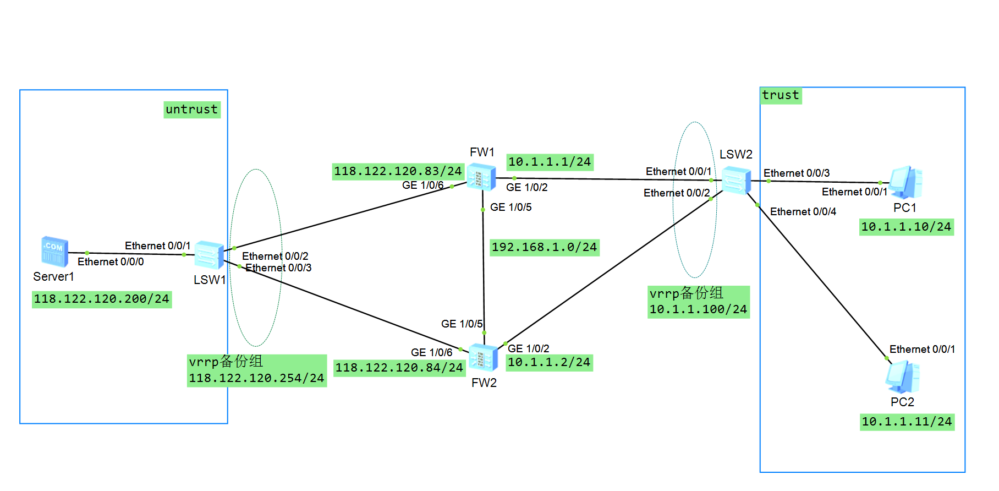

 
本实验使用ensp仿真模拟器配置


# 配置主备备份模式的双机热备
主备备份模式的双机热备，其中一台防火墙处于`Active`(活动)状态用于转发数据，另一台防火墙处于`Standby`(备份)状态不转发数据，两台防火墙通过心跳线同步信息。当处于Active状态的防火墙处于故障时，处于Standby状态的防火墙切换为Active状态，继续提供服务，以避免网络访问处于中断状态。
## 实验目的
配置HFW1防火墙为`Active`设备，配置HFW3防火墙为`Standby`设备，两台防火墙均可以访问互联网，当Active设备发生故障时能够实现切换，虚拟机访问互联网不会中断。
## 实验设备
华为`USG6000v`防火墙2台（简称HFW1、HFW3）
## 实验拓扑

## 基础配置
先登录防火墙，更改密码
``` bash
FW1:
Username:admin
Password:Admin@123
The password needs to be changed. Change now? [Y/N]: y
Please enter old password: Admin@123
Please enter new password: huawei@123
Please confirm new password: huawei@123
<USG6000V1> sy
Enter system view, return user view with Ctrl+Z.
[USG6000V1] sy FW1
[FW1]un in en
Info: Saving log files...
Info: Information center is disabled.
[FW1]

-------------------------------------------------------------

FW2:
Username:admin
Password:Admin@123
The password needs to be changed. Change now? [Y/N]: y
Please enter old password: Admin@123
Please enter new password: huawei@123
Please confirm new password: huawei@123
<USG6000V2> sy
Enter system view, return user view with Ctrl+Z.
[USG6000V2] sy FW2
[FW2]un in en
Info: Saving log files...
Info: Information center is disabled.
[FW2]
```
## 配置IP地址
FW1的防火墙接口IP地址
``` bash
FW1:
[FW1]int g1/0/6
[FW1-GigabitEthernet1/0/6]ip add 118.122.120.83 24
[FW1-GigabitEthernet1/0/6]service-manage ping permit 
[FW1]int g1/0/5
[FW1-GigabitEthernet1/0/5]ip add 192.168.1.1 24
[FW1-GigabitEthernet1/0/5]service-manage ping permit 
[FW1]int g1/0/2
[FW1-GigabitEthernet1/0/2]ip add 10.1.1.1 24
[FW1-GigabitEthernet1/0/2]service-manage ping permit 
```
FW2的防火墙接口IP地址
``` bash
FW2:
[FW2]int g1/0/6
[FW2-GigabitEthernet1/0/6]ip add 118.122.120.84 24
[FW2-GigabitEthernet1/0/6]service-manage ping permit 
[FW2]int g1/0/5
[FW2-GigabitEthernet1/0/5]ip add 192.168.1.2 24
[FW2-GigabitEthernet1/0/5]service-manage ping permit 
[FW2]int g1/0/2
[FW2-GigabitEthernet1/0/2]ip add 10.1.1.2 24
[FW2-GigabitEthernet1/0/2]service-manage ping permit 
```
## 配置防火墙安全区域
FW1的安全区域配置
```bash
[FW1]firewall zone trust 
[FW1-zone-trust]add int g1/0/2
[FW1]firewall zone untrust 
[FW1-zone-untrust]add int g1/0/6
[FW1]firewall zone dmz
[FW1-zone-dmz]add int g1/0/5
```
FW2的安全区域配置
```bash
[FW2]firewall zone trust 
[FW2-zone-trust]add int g1/0/2
[FW2]firewall zone untrust 
[FW2-zone-untrust]add int g1/0/6
[FW2]firewall zone dmz
[FW2-zone-dmz]add int g1/0/5
```
## 配置防火墙安全策略
FW1，FW2策略相同，这里用FW1做例子。
```bash
[FW1]security-policy 
[FW1-policy-security]rule name to_untrust
[FW1-policy-security-rule-to_untrust]source-zone trust 
[FW1-policy-security-rule-to_untrust]source-zone dmz
[FW1-policy-security-rule-to_untrust]source-zone local
[FW1-policy-security-rule-to_untrust]destination-zone any
[FW1-policy-security-rule-to_untrust]action permit 
[FW1-policy-security-rule-to_untrust]dis this
xxxx-xx-xx xx:xx:xx.xxx 
#
 rule name to_untrust
  source-zone dmz
  source-zone local
  source-zone trust
  action permit
#
return
```
## 配置nat策略
FW1,FW2相同，例FW1：
```bash
[FW1]nat-policy 
[FW1-policy-nat]rule name to_untrust_nat
[FW1-policy-nat-rule-to_untrust_nat]destination-zone untrust 
[FW1-policy-nat-rule-to_untrust_nat]action source-nat easy-ip 
[FW1-policy-nat-rule-to_untrust_nat]dis this
xxxx-xx-xx xx:xx:xx.xxx
#
 rule name to_untrust_nat
  destination-zone untrust
  action source-nat easy-ip
#
return
```
## 配置vrrp
FW1:
``` bash
[FW1]int g1/0/2
[FW1-GigabitEthernet1/0/2]vrrp vrid 1 virtual-ip 10.1.1.100 24 active 
[FW1]int g1/0/6
[FW1-GigabitEthernet1/0/6]vrrp vrid 2 virtual-ip 118.122.120.254 24 active 
```
FW2:
``` bash
[FW2]int g1/0/2
[FW2-GigabitEthernet1/0/2]vrrp vrid 1 virtual-ip 10.1.1.100 24 standby
[FW2]int g1/0/6
[FW2-GigabitEthernet1/0/6]vrrp vrid 2 virtual-ip 118.122.120.254 24 standby  
```
## 配置心跳线路
FW1:
``` bash
[FW1]hrp interface GigabitEthernet 1/0/5 remote 192.168.1.2
[FW1]hrp enable
Info: NAT IP detect function is disabled.
HRP_S[FW1]
HRP_S[FW1]dis hrp state
xxxx-xx-xx xx:xx:xx.xxx
 Role: active, peer: standby #活动
 Running priority: 45000, peer: 45000
 Backup channel usage: 0.00%
 Stable time: 0 days, 0 hours, 0 minutes
 Last state change information: 2024-09-27 13:05:59 HRP core state changed, old_
state = abnormal(standby), new_state = normal, local_priority = 45000, peer_prio
rity = 45000.

HRP_M[FW1]
```
FW2：
```bash
[FW2]hrp interface GigabitEthernet 1/0/5 remote 192.168.1.1
[FW2]hrp standby-device 
[FW2]hrp enable
Info: NAT IP detect function is disabled.
HRP_S[FW2]dis hrp state
xxxx-xx-xx xx:xx:xx.xxx 
 Role: standby, peer: active #备份
 Running priority: 45000, peer: 45000
 Backup channel usage: 0.00%
 Stable time: 0 days, 0 hours, 0 minutes
 Last state change information: 2024-09-27 13:05:58 HRP link changes to up.

HRP_S[FW2]
```
## 查看vrrp配置
FW1：
``` bash
HRP_M[FW1]dis vrrp
xxxx-xx-xx xx:xx:xx.xxxx 
  GigabitEthernet1/0/2 | Virtual Router 1
    State : Master #主根
    Virtual IP : 10.1.1.100 #虚拟网关
    Master IP : 10.1.1.1 #实际IP
    PriorityRun : 120
    PriorityConfig : 100
    MasterPriority : 120
    Preempt : YES   Delay Time : 0 s
    TimerRun : 60 s
    TimerConfig : 60 s
    Auth type : NONE
    Virtual MAC : 0000-5e00-0101
    Check TTL : YES
    Config type : vgmp-vrrp
    Backup-forward : disabled
    Create time : xxxx-xx-xx xx:xx:xx
    Last change time : xxxx-xx-xx xx:xx:xx
```
``` bash
  GigabitEthernet1/0/6 | Virtual Router 2
    State : Master #主根
    Virtual IP : 118.122.120.254 #虚拟网关
    Master IP : 118.122.120.83 #实际IP
    PriorityRun : 120
    PriorityConfig : 100
    MasterPriority : 120
    Preempt : YES   Delay Time : 0 s
    TimerRun : 60 s
    TimerConfig : 60 s
    Auth type : NONE
    Virtual MAC : 0000-5e00-0102
    Check TTL : YES
    Config type : vgmp-vrrp
    Backup-forward : disabled
    Create time : xxxx-xx-xx xx:xx:xx
    Last change time : xxxx-xx-xx xx:xx:xx

HRP_M[FW1]
```
FW2:
```bash
HRP_S[FW2]dis vrrp
xxxx-xx-xx xx:xx:xx.xxx 
  GigabitEthernet1/0/2 | Virtual Router 1
    State : Backup #备份
    Virtual IP : 10.1.1.100 #虚拟网关
    Master IP : 10.1.1.1 #实际IP
    PriorityRun : 120
    PriorityConfig : 100
    MasterPriority : 120
    Preempt : YES   Delay Time : 0 s
    TimerRun : 60 s
    TimerConfig : 60 s
    Auth type : NONE
    Virtual MAC : 0000-5e00-0101
    Check TTL : YES
    Config type : vgmp-vrrp
    Backup-forward : disabled
    Create time : xxxx-xx-xx xx:xx:xx
    Last change time : xxxx-xx-xx xx:xx:xx

  GigabitEthernet1/0/6 | Virtual Router 2
    State : Backup #备份
    Virtual IP : 118.122.120.254 #虚拟网关
    Master IP : 118.122.120.83 #实际IP
    PriorityRun : 120
    PriorityConfig : 100
    MasterPriority : 120
    Preempt : YES   Delay Time : 0 s
    TimerRun : 60 s
    TimerConfig : 60 s
    Auth type : NONE
    Virtual MAC : 0000-5e00-0102
    Check TTL : YES
    Config type : vgmp-vrrp
    Backup-forward : disabled
    Create time : xxxx-xx-xx xx:xx:xx
    Last change time : xxxx-xx-xx xx:xx:xx

HRP_S[FW2]
```
# 测试
至此，配置完成。现在可以测试功能了。
## 测试nat
PC1(10.1.1.10) ping Server1(118.122.120.200)
查看FW1会话表：
``` bash
HRP_M[FW1]display firewall session table 
xxxx-xx-xx xx:xx:xx.xxx 
 Current Total Sessions : 5
 icmp  VPN: public --> public  10.1.1.11:57776[118.122.120.83:2048] --> 118.122.
120.200:2048
 icmp  VPN: public --> public  10.1.1.11:58800[118.122.120.83:2052] --> 118.122.
120.200:2048
 icmp  VPN: public --> public  10.1.1.11:58544[118.122.120.83:2051] --> 118.122.
120.200:2048
 icmp  VPN: public --> public  10.1.1.11:58032[118.122.120.83:2049] --> 118.122.
120.200:2048
 icmp  VPN: public --> public  10.1.1.11:58288[118.122.120.83:2050] --> 118.122.
120.200:2048

```
可以看到，nat地址转换正常工作，将trust区域地址转换为FW1的G1/0/6的IP地址
## 模拟故障测试
故意将FW1的1/0/6关闭，模拟线路故障:
``` bash
HRP_M[FW1]int g1/0/6 (+B)
HRP_M[FW1-GigabitEthernet1/0/6]shutdown
HRP_S[FW1]dis vrrp
...
GigabitEthernet1/0/6 | Virtual Router 2
    State : Initialize #处于初始化状态
    Virtual IP : 118.122.120.254
    Master IP : 0.0.0.0
    PriorityRun : 120
    PriorityConfig : 100
    MasterPriority : 0
    Preempt : YES   Delay Time : 0 s
    TimerRun : 60 s
    TimerConfig : 60 s
    Auth type : NONE
    Virtual MAC : 0000-5e00-0102
    Check TTL : YES
    Config type : vgmp-vrrp
    Backup-forward : disabled

...
```
FW2:
``` bash
HRP_M<FW2>dis vrrp
...
GigabitEthernet1/0/6 | Virtual Router 2
    State : Master #FW2接替FW1成为主根
    Virtual IP : 118.122.120.254
    Master IP : 118.122.120.84
    PriorityRun : 120
    PriorityConfig : 100
    MasterPriority : 120
    Preempt : YES   Delay Time : 0 s
    TimerRun : 60 s
    TimerConfig : 60 s
    Auth type : NONE
    Virtual MAC : 0000-5e00-0102
    Check TTL : YES
    Config type : vgmp-vrrp
    Backup-forward : disabled
...
```
## 恢复端口，查看主动抢占是否正常
``` bash
HRP_S[FW1]int g1/0/6
HRP_S[FW1-GigabitEthernet1/0/6]un shutdown
```
稍等一会后，FW1变成主根
``` bash
  GigabitEthernet1/0/6 | Virtual Router 2
    State : Master #重新变成主根
    Virtual IP : 118.122.120.254
    Master IP : 118.122.120.83
    PriorityRun : 120
    PriorityConfig : 100
    MasterPriority : 120
    Preempt : YES   Delay Time : 0 s
    TimerRun : 60 s
    TimerConfig : 60 s
    Auth type : NONE
    Virtual MAC : 0000-5e00-0102
    Check TTL : YES
    Config type : vgmp-vrrp
    Backup-forward : disabled
```
FW1主动抢占正常。
